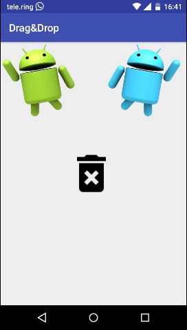

# DragAndDrop

A simple yet effective way to add DragAndDrop to your Android app!

[  ](https://bintray.com/georgwolle/DragAndDrop/DragAndDrop/_latestVersion)



# Introduction

The DragAndDrop framework is an easy to use android library to add drag and drop functionality to your app.
Unlike the official android Drag and Drop implementation (https://developer.android.com/guide/topics/ui/drag-drop) it is primarily designed for UI actions. I.e. with google's drag & drop it's very hard to change drawables easily on drag and drop actions. This library handles it with ease.

# Code

Init your view objects

```java

ImageView draggableView = findViewById(R.id.your_draggable_view_id);
ImageView droppableView = findViewById(R.id.your_droppable_view_id);

...

// Make a View object draggable

DragAndDropManager.with(draggableView)        // Initialize DragAndDropManager with your view
	.makeDraggable()                      // Make it draggable
	.addOnHover(droppableView,            // Optionally add a hover drawable for a specific droppable
             R.drawable.your_draggable_hover_drawable);

// Make a View object droppable

DragAndDropManager.with(droppableView)                                    // Initialize DragAndDropManager with your view
	.makeDroppable()                                                  // Other views might be dropped on this view
	.setOnHoverDrawable(R.drawable.your_droppable_hover_drawable);    // Optionally specify a drawable to change if another view is hovered
	.setOnHoverVibrate(15);                                           // Optionally set to vibrate vibrator in milliseconds if another view is hovered

// If you need more control

DragAndDropManager.with(droppableView)
	.makeDroppable
	.setOnDragListener(new DragAndDroppable.OnDragListener() {
                    @Override
                    public boolean onDrag(DragAndDroppable dragAndDroppable, DragAndDropEvent dragEvent) {
                        switch (dragEvent.getAction()) {
                            case DragAndDropEvent.ACTION_DRAG_STARTED:
                                  // Signals the start of a drag and drop operation.
				  break;
                            case DragAndDropEvent.ACTION_DRAG_LOCATION:
                                  // Sent during the whole drag
				  break;
                            case DragAndDropEvent.ACTION_DRAG_ENTERED:
                                  // Signals to a View that the drag point has entered the bounding box of the View.
				  break;
                            case DragAndDropEvent.ACTION_DRAG_EXITED:
                                  //Signals that the user has moved the draggable view out of the bounding box of the droppable View
				  break;
                            case DragAndDropEvent.ACTION_DROP:
                                  // Signals to the droppable that the user has released the draggable view, and the drag point is within the bounding box of the View
				  break;
                            case DragAndDropEvent.ACTION_DRAG_ENDED:
                                  // Signals to the droppable that the drag and drop operation has concluded.
                        }
                        return true;
                    }
                });

// The DragAndDropEvent is quiet similar to (https://developer.android.com/reference/android/view/DragEvent).


